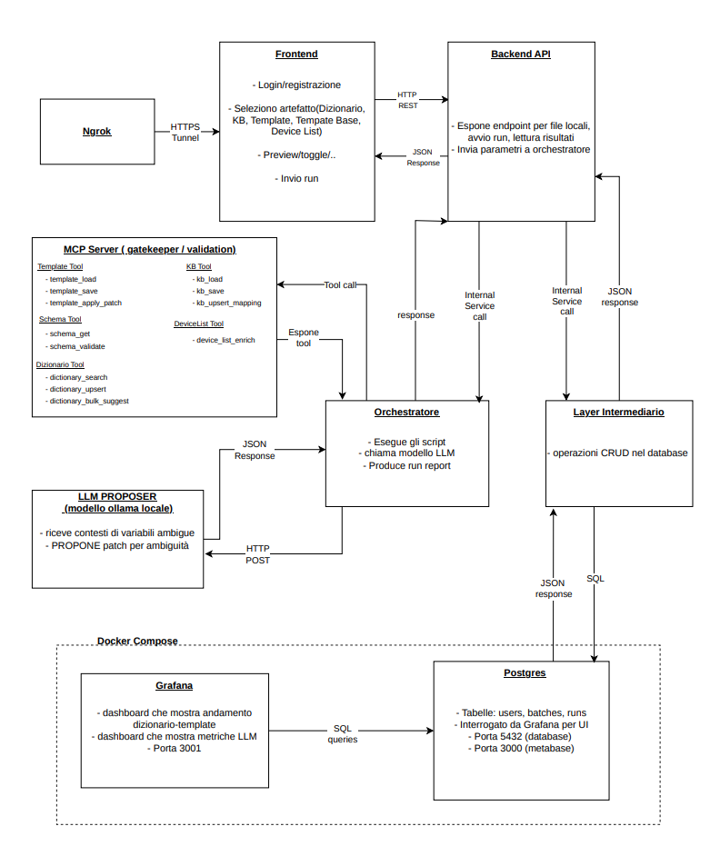

# 15. Architettura

## Scopo

Rappresentazione del flusso completo del sistema ad alto livello attraverso uno schema grafico

## Schema ad alto livello

## Note
- L’LLM non applica patch: è solo proposer.
- Tutte le scritture passano dal MCP Server (schema‑first + dry‑run).
